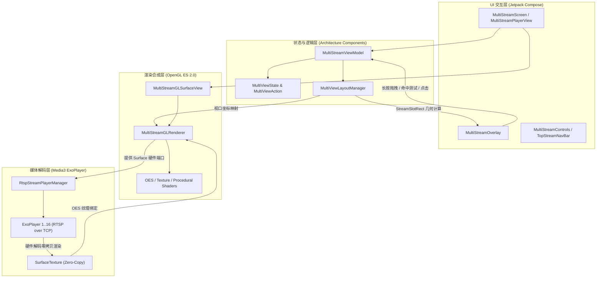

# MultiView - Android 高性能多路视频监控播放框架

[](https://developer.android.com)
[](https://kotlinlang.org)
[](https://developer.android.com/jetpack/compose)
[](https://developer.android.com/media/media3)
[](https://www.khronos.org/opengles/)

**MultiView** 是一款面向安防监控、应急调度、多视角直播等场景的高性能 Android 多路视频流聚合播放框架。基于 **Jetpack Compose + 单 SurfaceView OpenGL ES 视口复用 + Media3 ExoPlayer RTSP** 构建，攻克了移动端多路视频播放的解码开销、图层合成瓶颈与网络防抖难题，支持 **1 ~ 32 路**并发流畅硬件解码与多模式分屏切换。

---

## ✨ 核心特性

### 1. 🚀 单 SurfaceView 视口复用与硬件零拷贝
* **单 SurfaceView 架构**：彻底告别传统为每个画面创建单独 `SurfaceView` 或 `TextureView` 的设计，消除了多图层系统的 GPU 合成与内存带宽爆炸问题。
* **零拷贝硬件解码**：各路 ExoPlayer 播放器直接输出至独立的 `SurfaceTexture`（`GL_TEXTURE_EXTERNAL_OES`），通过动态 `glViewport` 与 `glScissor` 裁切技术，在单帧内一次性合成所有视频画面。
* **模拟信号着色器**：未接入真实视频流时，GL 端自动渲染科技感微网格与动态扫描线模拟监控画面（Procedural Shader）。

### 2. 📐 自适应分屏与分页引擎
* **智能自适应模式（AUTO）**：
  * **1 路**：单画面（`GRID_1`）
  * **2 路**：2 分屏（`GRID_2`，1 行 2 列等分）
  * **3 ~ 4 路**：4 分屏（`GRID_4`，2 行 2 列等分）
  * **5 ~ 6 路**：6 分屏（`GRID_6`，2 行 3 列等分）
  * **7 ~ 9 路**：9 分屏（`GRID_9`，3 行 3 列等分）
  * **9+ 路**：自动采用 9 分屏并启用横向手势滑动分页，支持底部分页指示器。
* **丰富预设分屏**：支持自适应（AUTO）、单画面、2 分屏、4 分屏、6 分屏、9 分屏、16 分屏、25 分屏、32 分屏（4x8 宽屏）以及 1+5、1+7 重点监控模式。
* **空槽位支持（Empty Slot）**：自动计算空闲槽位，OpenGL ES 进行背景安全裁剪，Compose 覆盖层渲染「暂无监控画面」占位卡片。

### 3. ⚡ 工业级播放重试与平滑错峰启动
* **错峰平滑启动（Staggered Startup）**：以 `100ms` 延迟步长平滑并发拉流，避免瞬间 CPU 满载、MediaCodec 资源争抢及服务端 FFmpeg 瞬时压力。
* **指数退避重试自愈**：播放异常或网络抖动时，按 `1.5s -> 3.0s -> 4.5s -> 5.0s` 自动指数递增重连；播放就绪后自动清空重试计数。
* **TCP 强制传输**：强制使用 RTP over RTSP (TCP)，有效防止 WiFi / 局域网 UDP 丢包、乱序与花屏。
* **状态实时双向反馈**：播放器状态（`PLAYING` / `CONNECTING` / `ERROR` / `IDLE`）实时同步至 UI 指示灯。

### 4. 🖐️ 长按拖动调换窗口顺序（交互与视觉动效）
* **长按手势检测**：基于视口归一化坐标精准命中通道槽位。
* **原窗口压暗提示**：长按触发后原窗口半透明遮罩并显示「正在调换该窗口...」。
* **跟随手指动效**：
  * **触点发光光晕**：`36dp` 半透明青色光晕内嵌发光圆点环绕手指接触点。
  * **浮动预览卡片**：跟随手指移动的深色预览卡片（带阴影、青色边框、状态灯、通道名称与摄像头图标）。
* **目标窗口悬停高亮**：目标窗口浮现 `3dp` 高亮边框与「释放以调换顺序」提示胶囊；悬停在空位时自动显示「释放调换至末尾」。
* **即时生效与轻量提示**：释放后立即重排通道顺序，并弹出浮动 Toast 反馈。

### 5. 🎬 单画面 / 全屏手势滑动与沉浸式体验
* **左右滑动手势切路**：全屏或单画面模式下支持横向拖拽切换上一路/下一路，两侧边缘实时露显切换预览卡片（带分辨率与帧率）。
* **HUD 切换胶囊**：切换通道后顶部弹出高科技感状态胶囊（2.2 秒后自动淡出）。
* **单击聚焦提示**：单击通道弹出高亮边框与「双击全屏 · 长按可拖动调换顺序」提示条（3 秒后自动淡出），右上角支持快捷关闭通道。
* **双击快速全屏**：双击任意分屏快速无缝全屏，双击全屏窗口快速退出。

---

## 🏗️ 架构设计



---

## 📁 目录结构

```text
MultiView/
├── app/
│   ├── src/main/
│   │   ├── java/com/wzvideni/multiview/
│   │   │   ├── MainActivity.kt               # 主入口 Activity
│   │   │   ├── gl/
│   │   │   │   ├── GLShaderHelper.kt         # OpenGL 着色器编译与程序链接工具
│   │   │   │   ├── IStreamFrameFeeder.kt     # 视频帧投递与 Surface 监听接口
│   │   │   │   ├── MultiStreamGLRenderer.kt  # OpenGL ES 核心视口复用合成渲染器
│   │   │   │   └── MultiStreamGLSurfaceView.kt # 承载渲染器的 GLSurfaceView 控件
│   │   │   ├── layout/
│   │   │   │   ├── MultiViewLayoutManager.kt # 自适应网格几何分割、分页与命中测试引擎
│   │   │   │   └── StreamSlotRect.kt         # 视口归一化矩形、GL 视口与像素矩形映射
│   │   │   ├── model/
│   │   │   │   ├── LayoutMode.kt             # 分屏模式枚举 (AUTO / 1 / 2 / 4 / 6 / 9 / 16 / 25 / 32 / 1+5)
│   │   │   │   ├── StreamChannel.kt          # 单路视频流通道数据模型
│   │   │   │   └── StreamStatus.kt           # 播放状态 (IDLE / CONNECTING / PLAYING / ERROR)
│   │   │   ├── player/
│   │   │   │   └── RtspStreamPlayerManager.kt # ExoPlayer RTSP 多路并发调度、错峰启动与重试管理
│   │   │   ├── state/
│   │   │   │   └── MultiViewState.kt         # UI 状态与用户交互动作 Action 定义
│   │   │   └── ui/
│   │   │       ├── FullscreenControls.kt     # 全屏模式控制栏、PTZ 云台与参数面板
│   │   │       ├── MultiStreamControls.kt    # 分屏模式底部控制栏 (分屏模式横滑切换)
│   │   │       ├── MultiStreamOverlay.kt     # Compose OSD、长按拖拽动效、触点光圈与浮动预览
│   │   │       ├── MultiStreamPlayerView.kt  # 核心播放视口组合件 (手势平移、HUD、分页圆点)
│   │   │       ├── MultiStreamScreen.kt      # 顶层监控页面容器与顶部路数快捷条
│   │   │       └── MultiStreamViewModel.kt   # 播放器核心业务逻辑与状态驱动
│   │   └── res/
│   │       └── drawable/                     # 提示、摄像头、空位、全屏矢量图标资源
├── mediamtx/                                 # 本地 RTSP 模拟推流与 ADB 调试支持
│   ├── adb_reverse_daemon.ps1                # ADB 反向代理后台自动守护脚本
│   ├── mediamtx.yml                          # MediaMTX 配置文件 (支持 1~32 路 main/sub 流)
│   └── start_mediamtx.bat                    # 一键启动推流与局域网 IP/端口自检脚本
└── build.gradle.kts                          # 项目构建配置
```

---

## 🚀 快速开始

### 1. 环境准备
* **Android Studio**：Ladybug (2024.2) 或更高版本
* **JDK**：Java 11 或 17
* **Android SDK**：`compileSdk = 37`, `minSdk = 24`

### 2. 编译项目
使用 Gradle Wrapper 进行编译：
```powershell
./gradlew assembleDebug
```
生成的 APK 位于：`app/build/outputs/apk/debug/app-debug.apk`。

### 3. 本地 RTSP 模拟多路推流测试
项目自带了用于研发测试的模拟推流环境（位于 `mediamtx/` 目录）：

1. **安装依赖**：安装 [MediaMTX](https://github.com/bluenviron/mediamtx) 和 [FFmpeg](https://ffmpeg.org/) 并加入系统 `PATH`。
2. **连接手机或模拟器**：通过 USB 连接 Android 设备并开启 USB 调试。
3. **一键启动模拟推流**：
   ```cmd
   cd mediamtx
   start_mediamtx.bat
   ```
   * 脚本会自动执行 `adb reverse tcp:8554 tcp:8554` 建立反向代理，手机端使用 `127.0.0.1:8554` 直连 PC，不受路由器子网隔离影响。
   * 支持按需（On-Demand）生成 `live/sub01` ~ `live/sub32`（辅码流）与 `live/main01` ~ `live/main32`（主码流）。
4. **运行 App**：在手机上打开 App，即可自动秒开多路流畅监控画面。

---

## 💻 关键技术指标

| 指标 | 表现 | 说明 |
| :--- | :--- | :--- |
| **并发路数** | 1 ~ 32 路 | 辅码流 640x360@15fps；主码流 1920x1080@25fps |
| **Surface 占用** | 仅 1 个 SurfaceView | 避免 MediaCodec 与 WindowManager 显存超限崩溃 |
| **传输协议** | RTSP over TCP | 工业安防规范，无丢包花屏 |
| **手势响应** | < 16ms 命中测试 | 基于归一化数学矩形算法实时计算 |
| **重试策略** | 1.5s ~ 5s 指数退避 | 服务重启或断网后自愈恢复 |

---

## 📄 开源许可

本项目遵循 MIT 开源许可证。
